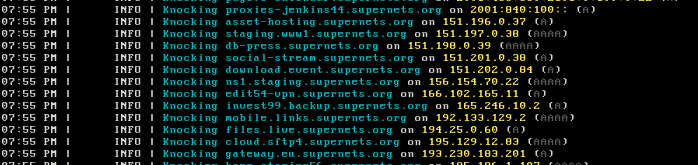

# pdKnockr
> A passive DNS "drive-by" tool

This tool is designed to detect passive DNS servers that are logging DNS queries by performing targeted subdomain lookups on a list of specified DNS resolvers. The core functionality of the program lies in its ability to generate unique subdomains using a seed value, ensuring that each query is distinct and traceable. This approach is particularly effective in identifying passive DNS servers, which typically log and store DNS queries for analysis and tracking purposes. By generating these unique queries, the tool can pinpoint which DNS resolvers are passively logging requests, a critical insight for network security analysis and privacy assessments.

The program operates by accepting a list of DNS resolver addresses and a seed value for subdomain generation. It then asynchronously queries each resolver with a dynamically generated subdomain, based on the provided seed, targeting a specific domain. The asynchronous nature of the tool allows for high-throughput and efficient querying, making it suitable for scanning a large number of resolvers in a short period. Users should note that while this tool provides valuable insights into DNS logging practices, it should be used responsibly and in compliance with applicable network and privacy regulations. It serves as a powerful instrument for network administrators, security researchers, and privacy advocates to understand and evaluate the extent of passive DNS logging in their networks or across various resolvers.

## How it works
When the program starts, it will generate a unique subdomain for each resolver.

This list is saved as JSON data in a `dns_keys.txt` file.

Th program will start firing off DNS queries to all the resolvers using the custom subdomain we made for each one:



After testing across multiple IP addresses over time, if we ever see `download.event.supernets.org` show up on any passive DNS lookup engines, we can simple use the following command:

```bash
jq 'to_entries | map({key: .value, value: .key}) | from_entries | ."download.event"' dns_keys.txt
```

This will return `151.202.0.84`, marking it as a DNS server that is actively logging all DNS queries that pass through.


## WORK IN PROGRESS (STAY TUNED)

This is all very theoretical right now, interested to see how this pans out.

Stats and proof coming soon. Get fucking fucked white-ops 💯